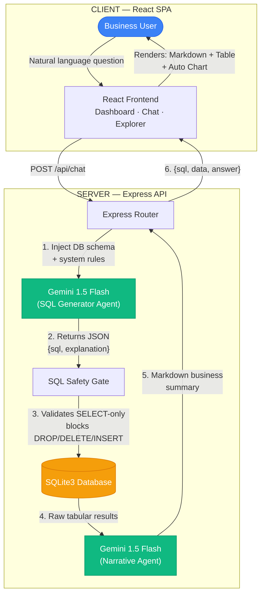
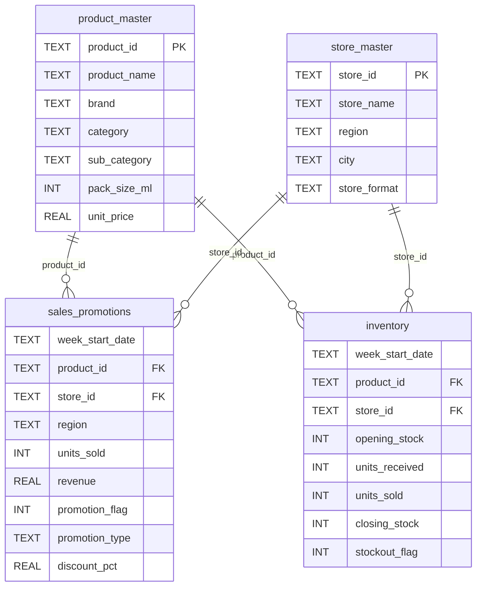

# 🥤 FMCG Beverages AI Assistant

> **🚀 Live Demo:** [https://fmcg-beverages-ai-assistant.onrender.com](https://fmcg-beverages-ai-assistant.onrender.com)

A conversational Business Intelligence (BI) assistant for FMCG category management. It enables non-technical business users — Brand Managers, Sales Directors, and Category Analysts — to query sales performance, inventory movements, and promotional campaign lifts using plain English.

The system translates natural language queries into valid SQLite statements, executes them against a simulated **16-week, 7,680-record** beverage division database, and returns structured datagrids, auto-generated charts, and narrative business insights.

---

## ✨ Key Features

| Feature | Description |
|---|---|
| **Category Dashboard** | Real-time KPIs (revenue, units sold, discount rate, stockout rate) with interactive horizontal bar charts by region, category, and top products |
| **Conversational SQL Chat** | Ask analytical questions in natural language (e.g., *"Compare BOGO sales of Pure Orange Juice across convenience stores in West vs East"*) |
| **SQL Auditability** | Toggle to inspect the exact SQL query generated and executed by the AI |
| **Data Spreadsheet** | Scrollable table preview of the raw database records returned by each query |
| **Auto Charting** | Dynamically renders horizontal comparison charts when query results contain numeric data |
| **Database Explorer** | Directly inspect raw schemas and all four tables (`product_master`, `store_master`, `sales_promotions`, `inventory`) |

---

## 🏗️ Project Structure

```
FMCG-Beverages-AI-Assistant/
│
├── server/                    # ── Backend (Express API Server) ──
│   └── index.js               #    REST API, Gemini integration, SQLite queries
│
├── src/                       # ── Frontend (React + Vite) ──
│   ├── App.jsx                #    Main React application (Dashboard, Chat, Explorer)
│   ├── main.jsx               #    React entry point
│   └── styles/
│       └── App.css            #    Global styles (glassmorphic dark theme, CSS variables)
│
├── scripts/                   # ── Data Pipeline ──
│   └── generate_data.js       #    Generates SQLite DB with 7,680 simulated records + CSV exports
│
├── index.html                 #  Vite HTML entry point (loads Google Fonts + React)
├── vite.config.js             #  Vite configuration (dev proxy to backend on port 5001)
├── package.json               #  Node.js dependencies and npm scripts
├── render.yaml                #  Render deployment blueprint
├── .env.example               #  Environment variable template
├── .env                       #  Your local environment variables (git-ignored)
└── .gitignore                 #  Git ignore rules
```

### Generated at Runtime (git-ignored)
```
├── fmcg_beverages.db          #  SQLite database (created by `npm run generate`)
├── *_sample.csv               #  Sample CSV exports (created by `npm run generate`)
├── dist/                      #  Production build output (created by `npm run build`)
└── node_modules/              #  Installed dependencies (created by `npm install`)
```

---

## 🛠️ Technology Stack

| Layer | Technology | Purpose |
|---|---|---|
| **Frontend** | React 18 + Vite 5 | Fast SPA with hot module replacement |
| **Styling** | Vanilla CSS + CSS Variables | Glassmorphic dark theme with micro-animations |
| **Typography** | Google Fonts (Inter, Outfit) | Premium, modern font pairing |
| **Backend** | Node.js + Express 4 | REST API server with SQLite query execution |
| **Database** | SQLite3 | Lightweight relational database (local file-based) |
| **AI/LLM** | Google Gemini 1.5 Flash | NL-to-SQL translation + business narrative generation |
| **Deployment** | Render | Persistent Node.js web service |

---

## 🚀 Getting Started

### Prerequisites

- **Node.js** v18 or higher — [Download](https://nodejs.org/)
- **npm** (bundled with Node.js)
- **Google Gemini API Key** — [Get one free](https://aistudio.google.com/apikey)

### Step 1: Clone the Repository

```bash
git clone https://github.com/praneethreddyganta/FMCG-Beverages-AI-Assistant.git
cd FMCG-Beverages-AI-Assistant
```

### Step 2: Install Dependencies

```bash
npm install
```

### Step 3: Configure Environment Variables

```bash
cp .env.example .env
```

Open `.env` and paste your Gemini API key:

```env
GEMINI_API_KEY=your_actual_gemini_api_key_here
PORT=5001
```

> **💡 Tip:** You can also paste the API key directly in the frontend UI header — no restart required.

### Step 4: Generate the Database

This creates the SQLite database (`fmcg_beverages.db`) with 7,680 simulated beverage transaction records:

```bash
npm run generate
```

### Step 5: Run the Application

You need **two terminal windows** running simultaneously:

**Terminal 1 — Start the Backend API Server:**
```bash
npm start
```
The Express server will start on `http://localhost:5001`.

**Terminal 2 — Start the Frontend Dev Server:**
```bash
npm run dev
```
The Vite dev server will start on `http://localhost:3000`.

### Step 6: Open in Browser

Navigate to **[http://localhost:3000](http://localhost:3000)** and start querying!

---

## 🏛️ System Architecture

The application implements an **Agentic NL-to-SQL Orchestration Loop** — a multi-phase pipeline that converts conversational queries into database results with AI-generated business narratives.



### Pipeline Phases

#### Phase A: Natural Language → SQL Translation
When a user submits a question, the backend constructs a prompt containing:
1. The full DDL schema of all 4 tables
2. System rules instructing the model to generate a single valid SQLite `SELECT` statement
3. Strict formatting instructions to output raw JSON: `{"sql": "SELECT ...", "explanation": "..."}`

#### Phase B: SQL Safety Gate & Query Execution
Before running any generated SQL:
- The backend parses the JSON response from Gemini
- Validates the statement begins with `SELECT` (read-only)
- Blocks dangerous keywords (`DROP`, `DELETE`, `INSERT`, `UPDATE`, `ALTER`, `CREATE`)
- Executes the validated query against the local SQLite database

#### Phase C: Business Narrative Generation
The server sends the original question, generated SQL, and raw query results back to Gemini. The model writes a concise business summary in Markdown — highlighting key drivers, promotional lifts, stockout rates — without technical database jargon.

#### Phase D: Dynamic Visualizations
The React client inspects the returned data rows:
- Detects numeric + text label column pairs
- Dynamically builds horizontal bar charts using pure CSS
- Provides toggles for raw datagrid and SQL code inspection

---

## 📊 Database Schema

The data pipeline structures beverage operations across **four relational tables**:



| Table | Type | Records | Description |
|---|---|---|---|
| `product_master` | Dimension | 15 | Beverage products across 5 brands and 5 categories |
| `store_master` | Dimension | 32 | Retail stores across 4 regions, 8 cities, 4 formats |
| `sales_promotions` | Fact | 7,680 | Weekly product-store transactions with promo details |
| `inventory` | Fact | 7,680 | Weekly stock levels tracking opening → closing stock flow |

### Data Generation Logic
- **16 weeks** of simulated data (Jan–Apr 2024)
- **15 products × 32 stores × 16 weeks** = 7,680 fact records per table
- **Promotion probability:** 15% of transactions include promotions
- **Promotion types:** Price Cut, BOGO, Display Feature, Bundle
- **Stockout simulation:** 8% replenishment delay chance triggers stock-zero events
- **Inventory model:** `closing_stock = (opening_stock + units_received) - units_sold`

---

## 🌐 Deployment

### Why Render (not Vercel)?

This app requires a **persistent Node.js process** to run the Express API server and maintain the local SQLite database file. Vercel's serverless functions are ephemeral and read-only — they cannot maintain persistent SQLite connections.

### Deploy to Render

A `render.yaml` blueprint is included. To deploy:

1. Push this repository to GitHub
2. Log in to your [Render Dashboard](https://dashboard.render.com/)
3. Click **New** → **Blueprint**
4. Select the `FMCG-Beverages-AI-Assistant` repository
5. Set the environment variable: `GEMINI_API_KEY` = *your_key*
6. Render automatically builds the frontend, generates the database, and starts the server

### Live Deployment

🌐 **Production URL:** [https://fmcg-beverages-ai-assistant.onrender.com](https://fmcg-beverages-ai-assistant.onrender.com)

---

## 📜 Available NPM Scripts

| Command | Description |
|---|---|
| `npm install` | Install all dependencies |
| `npm run generate` | Generate the SQLite database and sample CSVs |
| `npm run setup` | Install dependencies + generate database (one command) |
| `npm run dev` | Start Vite frontend dev server (port 3000) |
| `npm start` | Start Express backend API server (port 5001) |
| `npm run build` | Build production-ready frontend bundle to `dist/` |

---

## 🔑 API Endpoints

| Method | Endpoint | Description |
|---|---|---|
| `GET` | `/api/schema` | Returns the full SQLite DDL schema |
| `GET` | `/api/overview` | Returns dashboard KPIs and chart data |
| `POST` | `/api/chat` | Accepts `{message}`, returns `{sql, data, answer, explanation}` |

---

## 📝 License

This project was built as part of an AI Engineering assessment for FMCG category management.
