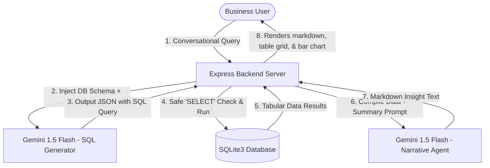

# FMCG Beverages AI Assistant

An end-to-end, conversational Business Intelligence (BI) assistant built for FMCG category management. It enables non-technical business users (Brand Managers, Sales Directors) to query sales performance, inventory movements, and promotional campaign lifts conversationally.

The system translates natural language queries into valid SQLite statements, executes them against a simulated 16-week, 7,680-record beverage division database, and displays structured datagrids, auto-generated charts, and narrative business insights.

## Features

- **Category Dashboard**: High-level visual KPIs (total revenue, units sold, discount rate, stockout rate) and interactive horizontal bar charts tracking revenue contribution by region, category, and top products.
- **Conversational SQL Chat**: Ask analytical questions (e.g., *"Compare BOGO sales of Pure Orange Juice across convenience stores in West vs East"*).
  - **SQL Code Toggle**: Clear visibility of the executed SQL query for auditability.
  - **Data Spreadsheet**: Scrollable table preview of the direct database records.
  - **Automatic Charting**: Dynamically draws horizontal comparison charts from query outputs if they contain numeric data.
- **Database Explorer**: Direct tab/page interface to inspect raw schemas and tables (`product_master`, `store_master`, `sales_promotions`, `inventory`).

## Technology Stack

- **Frontend**: React (Vite) + CSS Variables (Glassmorphic dark aesthetic)
- **Backend**: Node.js Express API Server
- **Database**: SQLite3
- **LLM API**: Google Gemini 1.5 Flash (utilizing the official `@google/generative-ai` SDK)

---

## Getting Started

### 1. Prerequisites
Ensure you have **Node.js** (v18+) and **Python 3** installed on your system.

### 2. Installation
Clone this repository and install the dependencies:
```bash
npm install
```

### 3. Generate Database
Populate the SQLite database and export sample CSV files:
```bash
python3 generate_data.py
```

### 4. Configuration
Create a `.env` file in the root directory:
```env
GEMINI_API_KEY=your_google_gemini_api_key_here
PORT=5001
```
*(Alternatively, you can paste your API key directly inside the settings panel in the frontend UI).*

### 5. Running the Application
```bash
# Start backend API (listening on port 5001)
node server.js

# In another terminal window, start Vite dev server (runs on port 3000)
npx vite
```
Open `http://localhost:3000` in your web browser.

## System & Model Architecture

The application implements an **Agentic NL-to-SQL Orchestration Loop** to query the database. Below is the detailed system diagram and step-by-step pipeline description:



### 1. Database Schema & Relational Design
The data pipeline structures beverage operations across four relational tables:
*   **`product_master` (Dimension Table)**: Resolves `product_id` to human-readable attributes (brand, sub-category, pack size, standard unit retail price).
*   **`store_master` (Dimension Table)**: Resolves `store_id` to geographical attributes (city, region, store format supermarket/convenience).
*   **`sales_promotions` (Fact Table)**: Tracks weekly product-store transactions. Links to dimensions using `product_id` and `store_id`. Contains continuous metrics (`units_sold`, `revenue`) and promotion details (`discount_pct`, `promotion_type`).
*   **`inventory` (Fact Table)**: Captures weekly stock levels. Models inventory movement: `closing_stock = (opening_stock + units_received) - units_sold`. Tracks `stockout_flag` (1 if stock hit zero).

---

### 2. Execution Pipeline

#### Phase A: Natural Language to SQL Translation
When a user submits a question, the backend server constructs a prompt containing:
1. The full DDL schema statements representing all 4 tables.
2. Direct system rules instructing the model to translate the query into a single valid SQLite statement.
3. Strict instructions to format the output as a raw JSON payload (no Markdown enclosing):
   ```json
   {
     "sql": "SELECT ...",
     "explanation": "Brief reasoning explaining how this query answers the request"
   }
   ```

#### Phase B: Safety Check & Query Execution
Before running the SQL against the local `fmcg_beverages.db` database:
- The backend parses the JSON payload.
- It runs a safety gate ensuring the statement strictly starts with the read-only command `SELECT`.
- It blocks dangerous keywords (like `DROP`, `DELETE`, `INSERT`, `UPDATE`, `ALTER`, `CREATE`) to prevent SQL injection.
- If the statement is valid, it runs via `sqlite3` and gets raw tabular records.

#### Phase C: Business Narrative Generation
The server feeds the original question, the generated SQL, and the raw query results back to Gemini. The model writes a concise business summary in Markdown, highlighting key drivers (promotional lifts, stockout rates, etc.) without using technical database jargon.

#### Phase D: Dynamic Visualizations
The React client inspects the database rows. If a numeric value (e.g., `revenue`, `units_sold`) and a text label are found:
- It computes the maximum value in the dataset.
- It dynamically builds horizontal bar charts using pure CSS styling, showing comparisons directly inside the chat log.
- Toggles allow the user to view the raw datagrid and inspect the generated SQL for maximum auditability.

---

## Deployment on Render (Recommended)

Since the application requires a persistent Node.js background process to run the Express API server and execute write-independent local SQLite files, **Render** is much more suitable than Vercel. 
*(Vercel is serverless-based; its serverless functions are ephemeral, read-only, and will lose connections or reset local SQLite database changes).*

We have included a `render.yaml` blueprint. To deploy the app to Render:
1. Log in to your **Render Dashboard**.
2. Click **New** $\rightarrow$ **Blueprint**.
3. Select your repository `FMCG-Beverages-AI-Assistant`.
4. Render will automatically build the React frontend, generate the SQLite database via Python, and run the backend.
5. In the Render environment settings, configure the environment variable:
   * `GEMINI_API_KEY`: *your_gemini_api_key*
